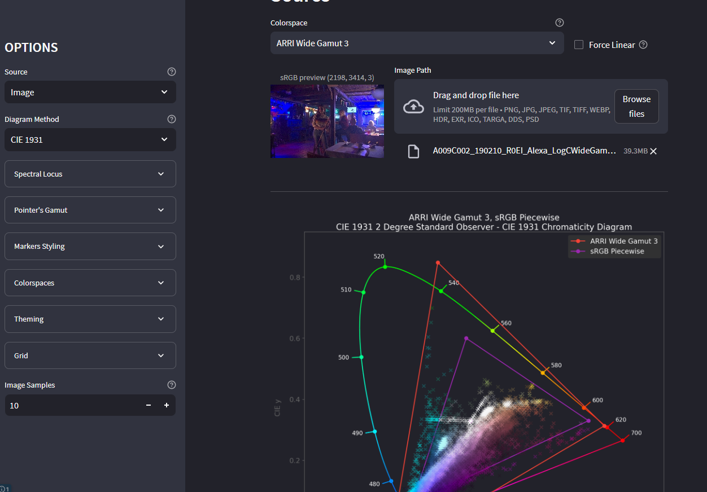

# streamlit_colourplotting

A streamlit web-application allowing to plot colors on a CIE Diagram using
the [colour-science](https://www.colour-science.org/) library.



The application allow to plot a single R-G-B color or a whole image using various
methods. A lot of options allow you to customize how the final diagram looks.

# Development

## Getting Started

Assuming you have :

- set the current working directory as desired
- installed [poetry](https://python-poetry.org/) on your system

```shell
git clone https://github.com/MrLixm/streamlit-colour-plotting.git
cd streamlit-colour-plotting
poetry update
```

You should now be able to run the application using the launcher :

```shell
./dev/run-streamlit.sh
```

You can now start editing code in [streamlit_colourplotting/](streamlit_colourplotting).

## Cocoon

Note that for color manipulation, this application use [cocoon](https://github.com/MrLixm/cocoon) which
is mostly a convenient wrapper around colour library.