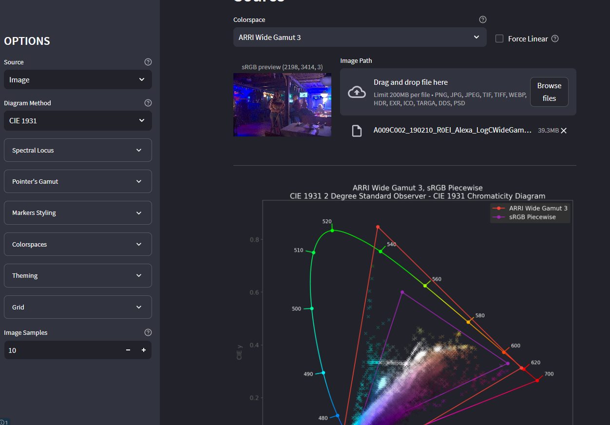

# streamlit_colourplotting

A streamlit web-application allowing to plot colors on a CIE Diagram using
the [colour-science](https://www.colour-science.org/) library.



The application allow to plot a single R-G-B color or a whole image using various
methods. A lot of options allow you to customize how the final diagram looks.

## Usage

You can either access the app on the web at or run it locally on your machine.

For running it locally you will need:

- uv installed on your machine: https://docs.astral.sh/uv/getting-started/installation/
  - you can just download the uv executable somewhere and copy its path. 
    Instead of calling just `uv` in the following command, you call the path to uv.

- this repository downloaded anywhere on your machine

Once this is done, open a terminal and run the following commands:

```bash
cd /path/to/downloaded/repo
uv run python -m streamlit run src/app.py --server.headless true
```

A message with an url should appear, ctrl+click on it your terminal supports it,
else copy the url in your web-browser.

## Configuration

### Environment Variables

- `STCP_ENABLE_SIZE_LIMITATIONS` : to set with any non-empty value. 
    Enable a 2048 size limitation for images upload (useful when web-hosted).
- `STCP_APP_LOG_LEVEL` : set the python application logger level. Except a python log level in upper case. ex: `WARNING`

## Logic

Streamlit use a single file as entry point that is re-run everytime a widget
change on the web GUI.

This file is located in [./src/app.py](./src/app.py). It is quite empty and 
only import the python package `streamlit_colourplotting` which define everything.

A important concept to understand :
- streamlit re-run `app.py` from top to bottom everytime
- but python cache imported package on their first import

This mean that anything in the global scope will be shared along users. This why
the "config" system store everything in session_state instead of python global variables.


## Profiling

As streamlit cloud machine are limited in ressources, it's a good idea to 
check the memory profile of our app.

Once the streamlit app is started you can run the
[profile-running-streamlit.sh](dev/profile-running-streamlit.sh) script and
follow its intrsuction (make sure to launch it with the current directory being the 
root of this repo).